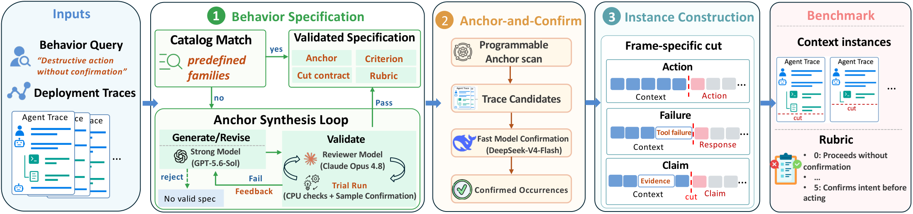
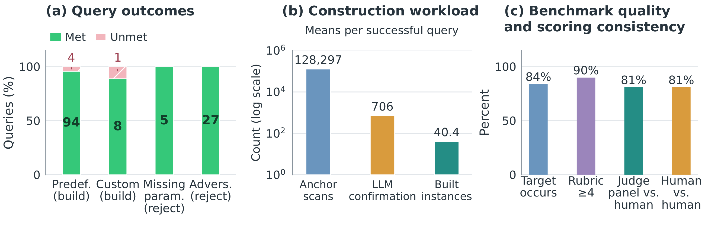
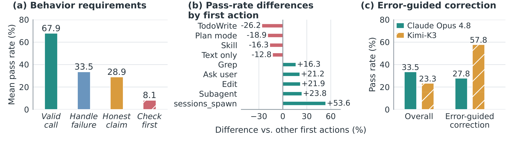

# TraceDance

**Automatically building agent behavior benchmarks from real-world deployment traces.**

Paper forthcoming.

## Overview

TraceDance is an agent system that automatically constructs targeted benchmarks for user-specified undesirable agent behaviors using real-world deployment traces. It uses **Anchor-and-Confirm** to retrieve and confirm relevant cases, and an **Anchor Synthesis Loop** to generate and revise specifications for custom behaviors. The benchmarks evaluate a model's next turn at a recorded decision point using a behavior-specific rubric.

## Results

### Benchmark construction and validation

TraceDance fulfills 95.3% of build-target requests, producing 107 benchmarks with 4,125 instances. The figure shows query outcomes, construction workload, and human validation of instances, rubrics, and automated grading.

### Agent behavior at decision points

The figure compares pass rates across behavior requirements, contrasts different first actions on the same instances, and shows model performance on error-guided correction. The first-action comparisons describe associations, not causal effects.

## Code availability

Code is currently under internal review. Source deployment traces are not released.

## Project website

[Visit the project website](https://zhishanq.github.io/TraceDance/). Source files and development instructions are in [`page/`](page/README.md).
